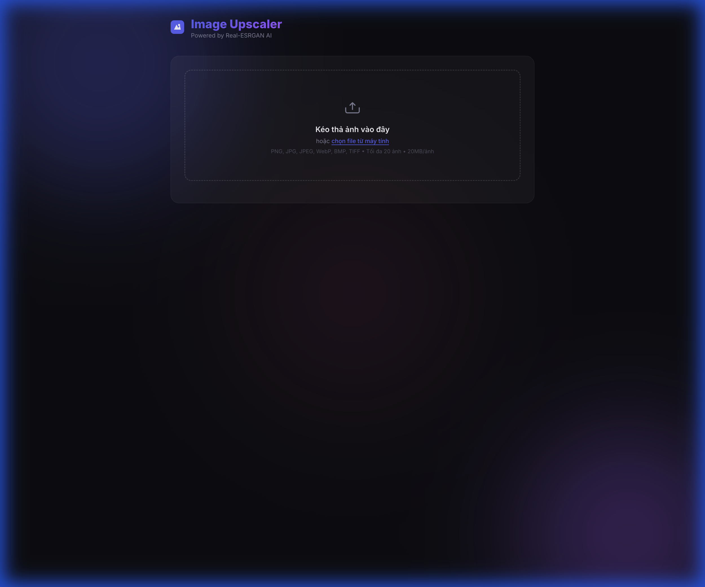

# 🖼️ Image Upscaler — Real-ESRGAN

Công cụ upscale ảnh sử dụng AI **Real-ESRGAN**, với giao diện web hiện đại. Hỗ trợ xử lý hàng loạt, nhiều tùy chọn scale, và giữ nguyên tên file gốc.



---

## ✨ Tính năng

- **Upload nhiều ảnh** — kéo thả hoặc chọn file (tối đa 20 ảnh, 20MB/ảnh)
- **Chọn scale**: 2x hoặc 4x
- **Chọn model AI**:
  - `General` — ảnh thường (RealESRGAN_x4plus)
  - `Anime` — ảnh anime/illustration (RealESRGAN_x4plus_anime_6B)
- **Tải từng ảnh** — giữ nguyên tên file gốc
- **Tự động phát hiện GPU**: CUDA → MPS (Apple Silicon) → CPU
- **Tự động tải model**: weights được download lần đầu chạy (~67MB)

---

## 📋 Yêu cầu hệ thống

| Thành phần | Yêu cầu |
|-----------|---------|
| Python | 3.9+ |
| RAM | ≥ 8GB (khuyến nghị 16GB) |
| GPU | Khuyến nghị (NVIDIA CUDA hoặc Apple MPS) |
| Dung lượng | ~2GB (bao gồm PyTorch + model weights) |

> **Lưu ý**: Có thể chạy trên CPU nhưng sẽ chậm hơn đáng kể.

---

## 🚀 Cài đặt & Chạy

### Cách 1: Script tự động (khuyến nghị)

```bash
# Clone repo
git clone <repo-url>
cd image-upscaler

# Chạy script cài đặt
chmod +x setup.sh
./setup.sh
```

Script sẽ tự động:
1. Tạo môi trường ảo (`venv/`)
2. Cài đặt tất cả dependencies
3. Fix lỗi tương thích basicsr/torchvision (nếu có)

### Cách 2: Cài đặt thủ công

```bash
# 1. Tạo môi trường ảo
python3 -m venv venv
source venv/bin/activate

# 2. Nâng cấp pip
pip install --upgrade pip setuptools wheel

# 3. Cài đặt dependencies
pip install -r requirements.txt
```

### Khởi chạy server

```bash
# Kích hoạt môi trường ảo (nếu chưa)
source venv/bin/activate

# Chạy server
python app.py
```

Mở trình duyệt tại: **http://localhost:8000**

---

## 📖 Hướng dẫn sử dụng

### Bước 1: Upload ảnh

- **Kéo thả** ảnh vào vùng upload, hoặc
- **Click** vào vùng upload để chọn file từ máy tính

Định dạng hỗ trợ: `PNG`, `JPG`, `JPEG`, `WebP`, `BMP`, `TIFF`

Sau khi upload, ảnh sẽ hiện preview phía dưới. Bấm nút **✕** trên mỗi ảnh để xóa nếu cần.

### Bước 2: Chọn cài đặt

| Tùy chọn | Giá trị | Mô tả |
|----------|---------|-------|
| **Scale Factor** | `2x` / `4x` | Hệ số phóng to. VD: ảnh 500×500 → 2x = 1000×1000, 4x = 2000×2000 |
| **Model** | `General` | Cho ảnh thường (người, phong cảnh, vật thể...) |
| | `Anime` | Tối ưu cho ảnh anime, illustration, manga |

### Bước 3: Upscale

- Bấm nút **"Upscale Images"**
- Đợi quá trình xử lý (có thanh tiến trình)
- Thời gian phụ thuộc vào: số lượng ảnh, kích thước ảnh, thiết bị (GPU/CPU)

| Thiết bị | Thời gian ước tính (1 ảnh 500×500, 4x) |
|---------|---------------------------------------|
| NVIDIA GPU | ~2-5 giây |
| Apple MPS | ~5-15 giây |
| CPU | ~1-5 phút |

### Bước 4: Tải kết quả

- Mỗi ảnh có nút **"Tải xuống"** riêng
- Bấm **"Tải tất cả (ZIP)"** để tải toàn bộ dưới dạng file ZIP
- Tên file giữ nguyên như file gốc
- Định dạng: giữ nguyên format gốc (JPG→JPG, PNG→PNG, WebP→WebP)
- Bấm **"Upscale thêm"** để xử lý batch mới

---

## 📁 Cấu trúc dự án

```
image-upscaler/
├── app.py               # Flask server + Real-ESRGAN processing
├── requirements.txt     # Python dependencies
├── setup.sh             # Script cài đặt tự động
├── .gitignore
├── venv/                # Môi trường ảo Python (không commit)
├── weights/             # Model weights (tự động tải, không commit)
└── static/
    ├── index.html       # Giao diện chính
    ├── style.css        # Stylesheet (dark theme)
    └── script.js        # Logic upload, progress, download
```

---

## ⚙️ API Endpoints

| Method | Endpoint | Mô tả |
|--------|---------|-------|
| `GET` | `/` | Giao diện web chính |
| `POST` | `/api/upscale` | Upload & upscale ảnh |
| `GET` | `/api/preview/<session_id>/<filename>` | Xem preview ảnh (inline) |
| `GET` | `/api/download/<session_id>/<filename>` | Tải 1 ảnh đã upscale |
| `GET` | `/api/download-zip/<session_id>` | Tải tất cả ảnh dạng ZIP |
| `POST` | `/api/cleanup/<session_id>` | Xóa file tạm của session |

### POST `/api/upscale`

**Request** (multipart/form-data):

| Field | Type | Mô tả |
|-------|------|-------|
| `images` | File[] | Các file ảnh (bắt buộc) |
| `scale` | int | `2` hoặc `4` (mặc định: `4`) |
| `model` | string | `RealESRGAN_x4plus` hoặc `RealESRGAN_x4plus_anime_6B` |

**Response** (JSON):
```json
{
  "success": true,
  "session_id": "uuid-string",
  "scale": 4,
  "model": "RealESRGAN_x4plus",
  "results": [
    {
      "original_name": "photo.jpg",
      "output_name": "photo.jpg",
      "width": 2000,
      "height": 2000,
      "download_url": "/api/download/<session_id>/photo.jpg"
    }
  ]
}
```

---

## 🔧 Xử lý sự cố

| Vấn đề | Giải pháp |
|--------|----------|
| `Port 5000/8000 is in use` | Đổi port trong `app.py` dòng cuối, hoặc tắt AirPlay Receiver (macOS) |
| `ModuleNotFoundError: functional_tensor` | Chạy lại `./setup.sh` (tự động fix) |
| `Out of memory` | App tự động chuyển sang tile-based processing. Nếu vẫn lỗi, dùng ảnh nhỏ hơn hoặc scale 2x |
| Model download chậm | Tải thủ công từ [GitHub Releases](https://github.com/xinntao/Real-ESRGAN/releases) vào thư mục `weights/` |

---

## 🙏 Credits

- [Real-ESRGAN](https://github.com/xinntao/Real-ESRGAN) — Xianxin Wang et al.
- [BasicSR](https://github.com/XPixelGroup/BasicSR) — Training framework
- [GFPGAN](https://github.com/TencentARC/GFPGAN) — Face enhancement
